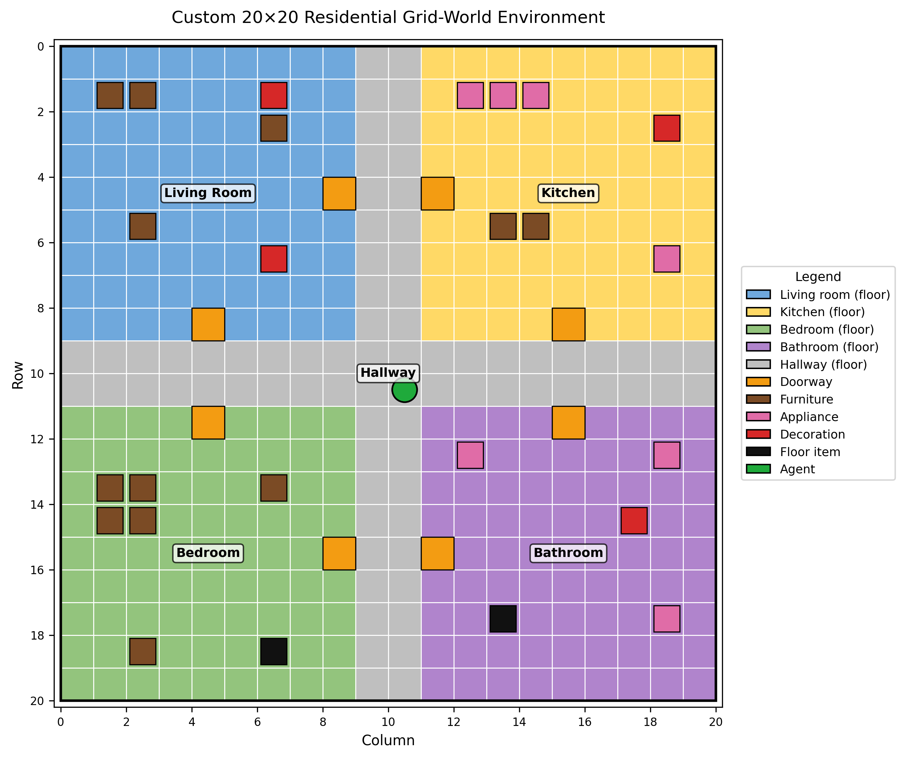

# Policy-Hard, Value-Easy: Inverted Actor-Critic Asymmetry in Deep RL for Assistive Indoor Navigation

[📄 Paper (Deep Learning Indaba 2026 Submission)](docs/DLI.pdf) ·
This repository contains the code accompanying the paper
*"Policy-Hard, Value-Easy: Inverted Actor-Critic Asymmetry in Deep Reinforcement Learning Based Assistive Indoor Navigation."*
We compare **Deep Q-Network (DQN)** and **Proximal Policy Optimization (PPO)**
for autonomous navigation of a visually-impaired-user proxy in a custom
grid-world that mimics a residential indoor layout, and empirically validate
an **inverted actor-critic asymmetry** architecture (deeper policy,
streamlined value network) for sparse-reward, topologically constrained
navigation.

## Table of Contents
- [Project Overview](#project-overview)
- [Installation](#installation)
- [Project Structure](#project-structure)
- [Custom Environment](#custom-environment)
- [Network Architectures](#network-architectures)
- [Training](#training)
- [Visualization](#visualization)
- [Results](#results)
- [Paper Reference](#paper-reference)
- [License](#license)
- [Contact](#contact)

## Project Overview
Indoor navigation for visually impaired users is a GPS-denied, safety-critical
problem that traditional mobility aids cannot solve at the level of global
path planning. This project contributes:

1. A lightweight **Gym-compatible grid-world environment** that abstracts the
   topological structure of a residential space (four semantic rooms,
   connecting hallway, static obstacles, and doorways) while remaining small
   enough to support rapid iteration and ablation studies.
2. A systematic **DQN vs PPO comparison** (5 DQN + 4 PPO configurations) on
   success rate, collision rate, average steps, and average reward.
3. Empirical validation of **inverted asymmetry** in actor-critic
   networks — contrary to the standard heuristic that favours a larger
   critic, we find that a deeper policy network combined with a streamlined
   value network produces the best-performing PPO agent on this domain.



## Installation
```bash
git clone https://github.com/SammyGbabs/Samuel_Babalola_RL_Summative.git
cd Samuel_Babalola_RL_Summative
pip install -r requirements.txt
```

**Dependencies:** Python 3.9+, Gymnasium, Stable-Baselines3, NumPy, Matplotlib.

## Project Structure
```
Samuel_Babalola_RL_Summative/
├── Environment/
│   ├── custom_env.py            # Custom Gym environment (IndoorNavEnv)
│   └── rendering.py             # Matplotlib-based top-down renderer + map data
├── Notebooks/
│   ├── DQN_Training.ipynb       # DQN training notebook (with plots)
│   └── PPO_Training.ipynb       # PPO training notebook (with plots)
├── Training/
│   ├── dqn_training.py          # DQN training script (Experiments 1–5)
│   └── ppo_training.py          # PPO training script (Experiments 1–4)
├── dqn_models/
│   ├── best_model.zip           # Best DQN agent (Exp 5 — see paper Table 3)
│   └── dqn_final_model.zip
├── ppo_models/
│   ├── best_model.zip           # Best PPO agent (Exp 4 — inverted asymmetry)
│   └── ppo_final_model.zip
├── docs/
│   ├── environment_preview.png  # Figure 1 of the paper
│   └── Final_Report.pdf         # Full paper (Deep Learning Indaba submission)
├── main.py                      # Visualisation / rollout entry point
└── requirements.txt
```

## Custom Environment
A 20×20 grid-world modelled as a Partially Observable Markov Decision
Process (POMDP). The agent has no global map access and perceives the world
through a compact state vector designed to be deployable on
resource-constrained hardware such as a smart cane or wearable device.

### Layout
Four semantically distinct rooms connected by a central hallway:

| Region       | Colour       |
|--------------|--------------|
| Living room  | Blue         |
| Kitchen      | Yellow       |
| Bedroom      | Green        |
| Bathroom     | Purple       |
| Hallway      | Gray         |
| Doorways     | Orange       |
| Furniture    | Brown        |
| Appliances   | Violet-pink  |
| Decorations  | Red          |
| Floor items  | Black        |
| Agent        | Green sphere |

### Action Space
Discrete, `A = {0, 1, 2, 3, 4}`:

| Action | Meaning |
|--------|---------|
| 0      | Up      |
| 1      | Down    |
| 2      | Left    |
| 3      | Right   |
| 4      | Wait    |

The `Wait` action is included to support future extensions to dynamic
environments (e.g., pausing for a moving pedestrian).

### Observation Space
A 16-dimensional compressed state vector `s ∈ ℝ^16`, split into three
semantically meaningful blocks:

- **Proximity sensors (5 dims):** binary flags indicating obstacles or
  doorways in the four cardinal neighbours and the current cell — a proxy
  for a local LiDAR / ultrasonic array.
- **Target information (4 dims):** one-hot encoding of the semantic target
  room (kitchen / bedroom / bathroom / living room).
- **Navigation state (7 dims):** normalised agent coordinates, Euclidean
  distance to the target, normalised remaining time budget, and a one-hot
  encoding of the current room type.

This vector representation is substantially more sample-efficient than
pixel observations and supports low-latency inference at deployment time.

### Reward Structure
The reward function balances **safety** against **path efficiency** by
combining dense step-by-step shaping with sparse topological bonuses to
address the credit-assignment problem in multi-room layouts:

| Component                         | Value      | Notes                                       |
|-----------------------------------|------------|---------------------------------------------|
| Step penalty                      | `-0.1`     | Applied at every step (encourages shortest path) |
| Collision penalty                 | `-5.0`     | **Terminates** the episode (strict risk aversion) |
| Doorway bonus                     | `+1.0`     | On successful doorway traversal             |
| Target completion bonus (dynamic) | `+15 + K·t_rem` | `t_rem` = steps remaining, `K` scaling constant |
| Timeout penalty                   | `-3.0`     | Agent failed to reach the target in 150 steps |

## Network Architectures
### DQN
Multi-Layer Perceptron approximating `Q*(s, a)`. The best configuration
(Experiment 5 in the paper) uses a `[512, 256]` hidden-layer MLP with ReLU
activations, ε-greedy exploration annealed from `1.0 → 0.02` over 15% of
training, learning rate `3e-4`, γ=0.99, replay buffer of 100k transitions,
and a batch size of 256. See Table 1 of the paper for all five DQN
configurations.

### PPO — Inverted Asymmetry
The central architectural contribution. Rather than the conventional
symmetric actor-critic or a larger-critic configuration, our best PPO
agent (Experiment 4 in the paper) pairs a **deep policy network** with a
**streamlined value network**:

```
Actor:   MLP(16 → 512 → 256 → 128 → 5)    # deep, LeakyReLU
Critic:  MLP(16 →      256 → 128 → 1)     # streamlined
```

**Rationale.** In mapless grid navigation the policy landscape is sharp
and discontinuous — a single-bit change in proximity sensing can require
completely inverting the action distribution — whereas the value
landscape is smooth and monotonic (geodesic distance to goal). The policy
therefore requires higher representational capacity than the value
function. Formally, `Lip(π) ≫ Lip(V)`. We call this **inverted
asymmetry** and term the task **policy-hard, value-easy**.

An incidental deployment benefit: the critic is discarded after training,
so only the lightweight actor runs on the edge device — minimising memory
footprint and battery usage.

## Training
Reproduce the paper's best configurations:

```bash
# DQN — reproduces Experiment 5 (best DQN)
python -m Training.dqn_training

# PPO — reproduces Experiment 4 (inverted asymmetry, best overall)
python -m Training.ppo_training
```

Trained models are written to `dqn_models/` and `ppo_models/`
respectively. Training notebooks (`Notebooks/*.ipynb`) include the
reward-curve and loss-curve plots from Figures 2–5 of the paper.

## Visualization
Roll out a trained agent and save per-step frames to disk:

```bash
# Visualise the PPO agent
python main.py --model-path ./ppo_models/best_model.zip --model-type ppo

# Visualise the DQN agent
python main.py --model-path ./dqn_models/best_model.zip --model-type dqn
```

Useful flags: `--episodes N`, `--step-delay SECONDS`, `--no-frames` (skip
per-step PNG saving), `--frames-dir PATH`. Run `python main.py --help`
for the full list.

## Results
**DQN Experimental Results** (Table 3 of the paper; SR = success rate,
CR = collision rate):

| Exp | SR   | CR | Avg Steps | Avg Reward |
|-----|------|----|-----------|------------|
| 1   | 70%  | 0% | 106.9     | −5.2       |
| 2   | 80%  | 0% | 69.6      | 12.8       |
| 3   | 10%  | 0% | 147.2     | −18.5      |
| 4   | 30%  | 0% | 89.3      | 3.1        |
| **5** | **100%** | **0%** | **28.6** | **25.4** |

**PPO Experimental Results** (Table 4 of the paper):

| Exp | Avg Reward | Avg Steps | CR   | SR   |
|-----|------------|-----------|------|------|
| 1   | 41.0       | 14.8      | ≈5%  | ≈95% |
| 2   | 22.7       | 55.5      | ≈2%  | ≈75% |
| 3   | 40.9       | 13.9      | ≈5%  | ≈95% |
| **4** (inverted asymmetry) | **41.1** | **14.3** | **≈3%** | **≈97%** |

**Best-Agent Comparison** (Table 5 of the paper):

| Metric          | DQN (Exp 5) | PPO (Exp 4) | Analysis                               |
|-----------------|-------------|-------------|----------------------------------------|
| Avg. Steps      | 28.60       | 14.3        | PPO ≈2× faster; near-optimal pathing   |
| Success Rate    | 100%        | ≈97%        | DQN never fails; the "safe" choice     |
| Convergence     | ∼250 eps    | ∼20 eps     | PPO is 12.5× more sample-efficient     |
| Loss Stability  | Oscillatory | Smooth      | PPO clipping prevents training collapse|

The best PPO agent achieves an average reward of **41.1** and reduces path
length by ≈50% relative to the best DQN agent. DQN however retains a
**0% collision rate** with 100% success, making it the "safety-first"
choice. The paper proposes a **hybrid architecture** — PPO as global
planner with a DQN/PID-based local controller as safety layer — as the
most promising path forward for deployable assistive navigation.

## Paper Reference
The full paper, *"Policy-Hard, Value-Easy: Inverted Actor-Critic
Asymmetry in Deep Reinforcement Learning Based Assistive Indoor
Navigation,"* is available at
[`docs/DLI.pdf`](docs/DLI.pdf). The paper's Appendix
links back to this repository for reproducibility.

Key findings summarised there:

- Inverted asymmetry (deep actor + shallow critic) is the superior PPO
  architecture for sparse-reward spatial navigation — challenging the
  standard heuristic favouring a larger critic.
- Navigation in this setting is empirically a **policy-hard, value-easy**
  problem: the Lipschitz constant of the optimal policy greatly exceeds
  that of the optimal value function.
- Doorway shaping rewards (`+1.0`) materially accelerate learning in
  segmented multi-room layouts.
- γ = 0.99 is the best discount factor for both DQN and PPO on this
  domain.

## License
Released under the [MIT License](LICENSE).

## Contact
**Samuel Oluwajunwonlo Babalola**
📧 [s.babalola@alustudent.com](mailto:s.babalola@alustudent.com)
Submission date: April 1, 2025
