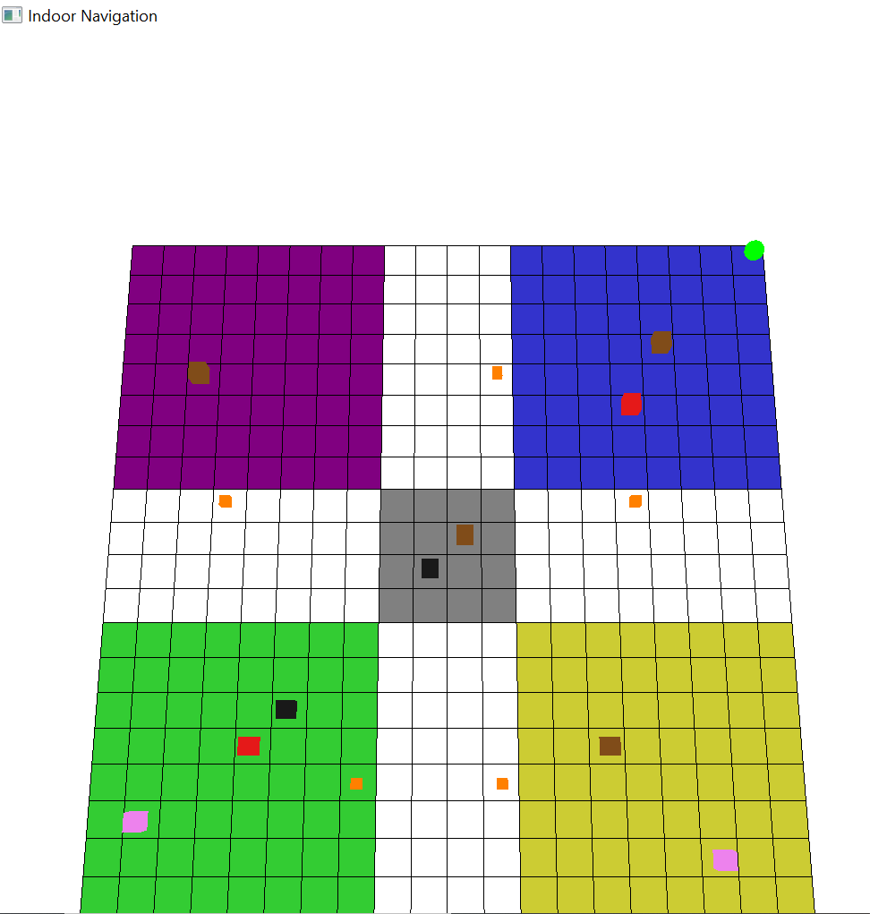

# Indoor Navigation RL Agent - Summative Project

[](https://drive.google.com/file/d/1spGp9PRDBwnUUeGqmQoyrbpl3z5n_hUi/view?usp=sharing)

A reinforcement learning project comparing Deep Q-Network (DQN) and Proximal Policy Optimization (PPO) for autonomous indoor navigation in a custom-built house environment.

## Table of Contents
- [Project Overview](#project-overview)
- [Installation](#installation)
- [Project Structure](#project-structure)
- [Custom Environment](#custom-environment)
- [Training Process](#training-process)
- [Visualization](#visualization)
- [Results](#results)
- [Report](#report)
- [License](#license)

## Project Overview
This project explores reinforcement learning techniques for assisting visually impaired individuals with indoor navigation. The agent learns to navigate a structured environment with multiple rooms and obstacles, aiming to maximize rewards and minimize collisions. Two RL approaches are compared:
- **DQN (Deep Q-Network):** A value-based learning method
- **PPO (Proximal Policy Optimization):** A policy-based learning method


## Installation
Clone the repository and install dependencies:
```bash
git clone https://github.com/SammyGbabs/Samuel_Babalola_RL_Summative.git
cd Samuel_Babalola_RL_Summative
pip install -r requirements.txt
```

## Project Structure
```
Samuel_Babalola_RL_Summative/
├── Environment/
│   ├── custom_env.py            # Custom Gym environment
│   ├── rendering.py             # PyOpenGL visualization
├── Notebooks/
│   ├── DQN_Training.ipynb       # DQN training notebook
│   ├── PPO_Training.ipynb       # PPO training notebook  
├── Training/
│   ├── dqn_training.py          # DQN training script
│   ├── ppo_training.py          # PPO training script
├── Models/
│   ├── dqn/
│   │   ├── best_model.zip       # Saved DQN model
│   │   ├── final_model.zip      # Final trained DQN model
│   ├── ppo/
│   │   ├── best_model.zip       # Saved PPO model
│   │   ├── final_model.zip      # Final trained PPO model
├── docs/                        # Report and visualizations
├── main.py                      # Main entry point
└── requirements.txt             # Dependencies
```

## Custom Environment
**Action Space (Discrete):**
- `0`: Move Up
- `1`: Move Down
- `2`: Move Left
- `3`: Move Right
- `4`: Wait

**Observation Space (16-dimensional vector):**
- Proximity sensors (5 values)
- Target room encoding (4 values)
- Navigation state (7 values)

**Reward Structure:**
- **+15** for reaching the target
- **+1** for doorway usage
- **-5** for collisions
- **-0.1** per step penalty

## Training Process
Run training scripts:
```bash
# Train DQN
python -m Training.dqn_training

# Train PPO
python -m Training.ppo_training
```

## Visualization
To run the trained agent with visualization:
```bash
python -m main --model-path ./Models/ppo/best_model.zip --model-type ppo --fps 2 --step-delay 0.5
```
**Key Features:**
- Real-time agent movement tracking
- Obstacle and doorway highlighting
- Path history visualization
- Multiple camera angles

## Results
**Performance Comparison:**
| Metric        | DQN  | PPO  |
|--------------|------|------|
| Avg. Steps   | 32.1 | 14.3 |
| Avg. Reward  | 38.86| 41.1 |
| Training Time| 45min| 1hr  |

PPO outperformed DQN in efficiency, achieving better rewards in fewer steps while maintaining stability.

## Report
Detailed findings are documented in **Final_Report.pdf**, including:
- PPO's faster convergence in complex layouts
- DQN's effectiveness with sparse rewards
- Doorway bonuses improving learning speed by 40%
- Optimal **γ (gamma)** value found to be **0.99** for both methods

## License
This project is licensed under the **MIT License**. See the LICENSE file for details.

## Contact
**Samuel Oluwajunwonlo Babalola**  
Email: [s.babalola@alustudent.com](mailto:s.babalola@alustudent.com)  
Submission Date: **April 1, 2025**